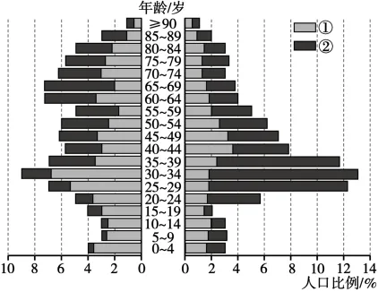

# 2025年福建高考地理真题 · 选择题题组 G5（第11–13题）

## 来源
- 来源文档：精品解析：2025年福建高考地理真题（解析版）.docx
- 题号：第11–13题（选择题，共3小题）

## 题组材料
G社区位于巴塞罗那市的中心区，是欧洲最具魅力的旅游地之一，不断吸引从事金融、设计等职业的跨国移民来此定居。下图示意1998年和2016年该社区原有居民与跨国移民的年龄结构；1998年该社区原有居民多为长期租户；1998—2016年该社区人口总量较稳定，跨国老年移民减少。据此完成下面小题。

## 相关图片


## 第11题
question_id: `2025-福建-地理-2025年福建高考地理真题-Q11`

**题干**：11. 关于图示，下列对应正确的是（   ）

**选项**：
- A. 左侧代表1998年，①代表跨国移民
- B. 左侧代表1998年，①代表原有居民
- C. 右侧代表1998年，①代表跨国移民
- D. 右侧代表1998年，①代表原有居民

**答案**：B

**解析**：1998年原有居民是长期租户，年龄结构可能偏向中老年，跨国移民从事金融、设计等职业，多为青壮年劳动力，且跨国老年移民减少，所以跨国移民年龄结构应更集中在青壮年。读图，左侧年龄结构中，50岁及以上人口比例较高，尤其是70-90岁年龄段有明显分布，符合原有居民长期居住、年龄偏大的特点；右侧年龄结构中，25-44岁人口比例显著较高，50岁以上人口比例较低，符合青壮年跨国移民的特征，且老年移民减少也使得右侧老年人口少。图中①和②为两种人群，左侧50岁以上人口以①（灰色）为主，右侧25-44岁人口以②（黑色）为主。所以左侧代表1998年，①代表原有居民，右侧代表2016年，②代表跨国移民，B正确，ACD错误。故选B。

**知识点归属**：
- **核心考点 · 权重 1.0**：人文地理 → 人口 → 人口年龄结构
- **支撑知识 · 权重 0.7**：人文地理 → 人口 → 人口迁移

**整体置信度**：高

<!-- MANAGED-KM-START Q11
```yaml
question_id: "2025-福建-地理-2025年福建高考地理真题-Q11"
question_number: 11
knowledge_points:
  - role: core_exam_point
    weight: 1.0
    domain_id: DM-HUM
    domain: "人文地理"
    theme_id: TH-HUM-POPULATION
    theme: "人口"
    knowledge_unit_id: KU-HUM-POP-007
    knowledge_unit: "人口年龄结构"
    evidence: "依据不同年龄段人口比例识别原有居民与跨国移民的年龄构成差异，并据此判断图示年份和人群。"
  - role: supporting_knowledge
    weight: 0.7
    domain_id: DM-HUM
    domain: "人文地理"
    theme_id: TH-HUM-POPULATION
    theme: "人口"
    knowledge_unit_id: KU-HUM-POP-002
    knowledge_unit: "人口迁移"
    evidence: "跨国移民的职业选择性和老年移民减少解释了其青壮年占比高、老年人口占比低的结构特征。"
extra_tags:
  - "迁移人口年龄结构"
  - "人口年龄金字塔"
taxonomy_version: "config-v0.2-draft"
confidence: "high"
label_status: "completed"
needs_review: false
taxonomy_review:
  needs_review: false
  issue_type: "none"
  review_note: ""
note: ""
```
-->

## 第12题
question_id: `2025-福建-地理-2025年福建高考地理真题-Q12`

**题干**：12. 1998—2016年该社区原有居民迁移的主要影响因素是（   ）

**选项**：
- A. 生活成本
- B. 公共服务
- C. 人口密度
- D. 自然环境

**答案**：A

**解析**：G社区位于巴塞罗那市中心区，是"欧洲最具魅力的旅游地之一"，且吸引大量跨国移民定居。市中心区因旅游业和人口流入，土地和住房需求增加，生活成本（如房租、物价）会显著上升。原有居民多为长期租户，面对生活成本上涨，可能选择向郊区迁移以降低支出，A正确。公共服务（如医疗、教育）市中心通常更完善，不会成为迁移的推力，B错误；市中心人口密度高，但人口密度不是导致原有居民迁出的主要因素，C错误；自然环境不是导致市中心人口迁出的主要影响因素，D错误。故选A。

**知识点归属**：
- **核心考点 · 权重 1.0**：人文地理 → 人口 → 影响人口迁移的因素

**整体置信度**：高

<!-- MANAGED-KM-START Q12
```yaml
question_id: "2025-福建-地理-2025年福建高考地理真题-Q12"
question_number: 12
knowledge_points:
  - role: core_exam_point
    weight: 1.0
    domain_id: DM-HUM
    domain: "人文地理"
    theme_id: TH-HUM-POPULATION
    theme: "人口"
    knowledge_unit_id: KU-HUM-POP-003
    knowledge_unit: "影响人口迁移的因素"
    evidence: "旅游吸引力和跨国移民流入推高中心区房租物价，原有长期租户因生活成本上升而迁出。"
extra_tags:
  - "绅士化背景下居民迁出"
  - "生活成本推力"
taxonomy_version: "config-v0.2-draft"
confidence: "high"
label_status: "completed"
needs_review: false
taxonomy_review:
  needs_review: false
  issue_type: "none"
  review_note: ""
note: ""
```
-->

## 第13题
question_id: `2025-福建-地理-2025年福建高考地理真题-Q13`

**题干**：13. 相比1998年，2016年该社区（   ）

**选项**：
- A. 劳动力供给短缺
- B. 人口素质整体下降
- C. 养老院数量增加
- D. 幼儿教育质量提高

**答案**：D

**解析**：对比1998年（左侧）和2016年（右侧）图可知，2016年②（跨国移民）在25—44岁劳动年龄人口比例显著增加，劳动力供给充足，A错误。跨国移民从事金融、设计等职业，通常具有较高素质，人口素质整体应上升，B错误。1998年①（原有居民）老年人口比例高，2016年老年人口比例下降，且跨国老年移民减少，老年人口数量减少，养老院数量会减少，C错误。跨国移民从事金融、设计等职业，通常具有较高素质，可能推动社区幼儿教育资源投入和质量提升，D正确。故选D。

【点睛】人口迁移的原因包括自然、经济、政治、文化等多个方面。地区间经济发展水平的差异（经济发展、城市化、区域开发、大型工程建设等）是引起人口迁移的重要原因。一般经济落后地区迁出率高，而发达地区迁入率较高。

**知识点归属**：
- **核心考点 · 权重 1.0**：人文地理 → 人口 → 人口迁移

**整体置信度**：高

<!-- MANAGED-KM-START Q13
```yaml
question_id: "2025-福建-地理-2025年福建高考地理真题-Q13"
question_number: 13
knowledge_points:
  - role: core_exam_point
    weight: 1.0
    domain_id: DM-HUM
    domain: "人文地理"
    theme_id: TH-HUM-POPULATION
    theme: "人口"
    knowledge_unit_id: KU-HUM-POP-002
    knowledge_unit: "人口迁移"
    evidence: "从事金融、设计等职业的青壮年跨国移民增加，改变社区人口构成并可能带动幼儿教育资源与质量提升。"
extra_tags:
  - "高技能移民的社区影响"
  - "幼儿教育服务"
taxonomy_version: "config-v0.2-draft"
confidence: "high"
label_status: "completed"
needs_review: false
taxonomy_review:
  needs_review: false
  issue_type: "none"
  review_note: ""
note: ""
```
-->

## 教学备注
<!-- TEACHER-NOTES-START -->
- 易错点：
- 课堂提示：
- 讲解建议：
<!-- TEACHER-NOTES-END -->
