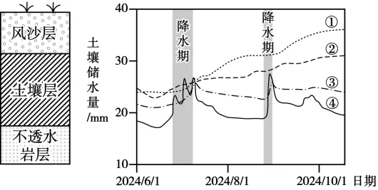

# 2025年福建高考地理真题 · 选择题题组 G6（第14–16题）

## 来源
- 来源文档：精品解析：2025年福建高考地理真题（解析版）.docx
- 题号：第14–16题（选择题，共3小题）

## 题组材料
我国某区域地势平坦，风沙层相对稳定，分布着稀疏矮小的植物。该区域的植被反射率低于风沙层，植被覆盖度小于30%。下左图示意该区域的典型剖面，下右图示意该区域不同厚度(10cm、50cm、90cm和200cm)风沙层下土壤储水量变化。据此完成下面小题。

## 相关图片


## 第14题
question_id: `2025-福建-地理-2025年福建高考地理真题-Q14`

**题干**：14. 与50cm厚度风沙层下土壤储水量变化对应的曲线是（   ）

**选项**：
- A. ①
- B. ②
- C. ③
- D. ④

**答案**：C

**解析**：风沙层越薄，土壤层储水量受降水波动影响越大，风沙层下土壤储水量变化越大。根据图示信息可知，④曲线在降水期土壤储水量变化最剧烈，应为10cm风沙层，③曲线在降水期变化第二剧烈，应为50cm风沙层，C正确，ABD错误。故选C。

**知识点归属**：
- **核心考点 · 权重 1.0**：自然地理 → 植被与土壤 → 土壤的组成与观察

**整体置信度**：高

<!-- MANAGED-KM-START Q14
```yaml
question_id: "2025-福建-地理-2025年福建高考地理真题-Q14"
question_number: 14
knowledge_points:
  - role: core_exam_point
    weight: 1.0
    domain_id: DM-NAT
    domain: "自然地理"
    theme_id: TH-NAT-VEGETATION-SOIL
    theme: "植被与土壤"
    knowledge_unit_id: KU-NAT-VEG-SOIL-004
    knowledge_unit: "土壤的组成与观察"
    evidence: "风沙层厚度影响降水下渗后土壤水分波动幅度，需依据土壤水分组成及曲线变化识别50厘米厚度。"
extra_tags:
  - "风沙层厚度与土壤储水"
  - "土壤水分曲线判读"
taxonomy_version: "config-v0.2-draft"
confidence: "high"
label_status: "completed"
needs_review: false
taxonomy_review:
  needs_review: false
  issue_type: "none"
  review_note: ""
note: ""
```
-->

## 第15题
question_id: `2025-福建-地理-2025年福建高考地理真题-Q15`

**题干**：15. 相比砂土，土壤为黏土时，90cm厚度风沙层下的土壤层（   ）

**选项**：
- A. 降水期土壤储水量增加速率较大，整个时期平均土壤储水量较大
- B. 降水期土壤储水量增加速率较大，整个时期平均土壤储水量较小
- C. 降水期土壤储水量增加速率较小，整个时期平均土壤储水量较大
- D. 降水期土壤储水量增加速率较小，整个时期平均土壤储水量较小

**答案**：D

**解析**：相比砂土，土壤为黏土时孔隙度更低，地表水更不易下渗，降水期土壤储水量增加速率较小。黏土孔隙度更低，土壤储水空间更少，整个时期平均土壤储水量较小。综上所述，D正确，ABC错误。故选D。

**知识点归属**：
- **核心考点 · 权重 1.0**：自然地理 → 植被与土壤 → 土壤的组成与观察

**整体置信度**：高

<!-- MANAGED-KM-START Q15
```yaml
question_id: "2025-福建-地理-2025年福建高考地理真题-Q15"
question_number: 15
knowledge_points:
  - role: core_exam_point
    weight: 1.0
    domain_id: DM-NAT
    domain: "自然地理"
    theme_id: TH-NAT-VEGETATION-SOIL
    theme: "植被与土壤"
    knowledge_unit_id: KU-NAT-VEG-SOIL-004
    knowledge_unit: "土壤的组成与观察"
    evidence: "砂土与黏土质地和孔隙特征不同，进而影响降水期储水增加速率及平均储水量。"
extra_tags:
  - "土壤质地与储水能力"
taxonomy_version: "config-v0.2-draft"
confidence: "high"
label_status: "completed"
needs_review: false
taxonomy_review:
  needs_review: false
  issue_type: "none"
  review_note: ""
note: ""
```
-->

## 第16题
question_id: `2025-福建-地理-2025年福建高考地理真题-Q16`

**题干**：16. 图中所示剖面的风沙层厚度增大和地表植被覆盖度减小，将分别导致（   ）

**选项**：
- A. 土壤温度年变化减小，地表年均温降低
- B. 土壤温度年变化减小，地表年均温增高
- C. 土壤温度年变化增大，地表年均温降低
- D. 土壤温度年变化增大，地表年均温增高

**答案**：A

**解析**：根据第一题分析可知，风沙层越薄，风沙层下土壤储水量变化越大。土壤风沙层厚度越大，土壤储水量越稳定，土壤温度年变化越小，CD错误；植被反射率低于风沙层，地表植被覆盖度减小，地表反射的太阳辐射更多，吸收的太阳辐射更少，地表年均温降低，A正确，B错误。故选A。

【点睛】土壤含水量受多种因素影响，主要包括：气象因素：降水：降水量大时，土壤的水分含量高。蒸发：温度高时，蒸发量大，土壤水分少。土壤特征：孔隙度：土壤孔隙度大，有利于水分的储存。容重和渗透性能：这些因素影响土壤对水分的吸收和保持能力。植被状况：植被通过吸收和蒸腾作用消耗土壤水分，不同植被类型的根系深度和密度会影响土壤含水量的垂直分布。人为活动：灌溉方式（如漫灌、喷灌、滴灌、根灌）影响土壤水分。不合理的灌溉方式（如大水漫灌）会在短时间内提高土壤的含水量，但随后可能会因强烈蒸发而导致土壤中的水分明显减少，甚至可能引起土壤盐碱化。

**知识点归属**：
- **核心考点 · 权重 1.0**：自然地理 → 自然环境的整体性与差异性 → 自然环境要素间的物质迁移和能量交换
- **支撑知识 · 权重 0.7**：自然地理 → 植被与土壤 → 植被与环境
- **支撑知识 · 权重 0.7**：自然地理 → 大气 → 大气的受热过程

**整体置信度**：高

<!-- MANAGED-KM-START Q16
```yaml
question_id: "2025-福建-地理-2025年福建高考地理真题-Q16"
question_number: 16
knowledge_points:
  - role: core_exam_point
    weight: 1.0
    domain_id: DM-NAT
    domain: "自然地理"
    theme_id: TH-NAT-INTEGRITY
    theme: "自然环境的整体性与差异性"
    knowledge_unit_id: KU-NAT-INTEGRITY-001
    knowledge_unit: "自然环境要素间的物质迁移和能量交换"
    evidence: "土壤层厚度与水热缓冲、植被覆盖与地表辐射收支共同体现土壤和生物要素对地表热量平衡的影响。"
  - role: supporting_knowledge
    weight: 0.7
    domain_id: DM-NAT
    domain: "自然地理"
    theme_id: TH-NAT-VEGETATION-SOIL
    theme: "植被与土壤"
    knowledge_unit_id: KU-NAT-VEG-SOIL-001
    knowledge_unit: "植被与环境"
    evidence: "植被覆盖度变化会改变地表反射率和太阳辐射吸收量，进而影响地表年均温。"
  - role: supporting_knowledge
    weight: 0.7
    domain_id: DM-NAT
    domain: "自然地理"
    theme_id: TH-NAT-ATMOSPHERE
    theme: "大气"
    knowledge_unit_id: KU-NAT-ATM-HEAT-003
    knowledge_unit: "大气的受热过程"
    evidence: "植被反射率低于风沙层，植被覆盖减少使地表反射增强、吸收太阳辐射减少并降低年均温。"
extra_tags:
  - "风沙层水热缓冲效应"
  - "植被反射率与地表热量平衡"
taxonomy_version: "config-v0.2-draft"
confidence: "high"
label_status: "completed"
needs_review: false
taxonomy_review:
  needs_review: false
  issue_type: "none"
  review_note: ""
note: "核心机制为土壤与植被共同影响地表热量平衡；两个支撑节点分别承载植被反射率和地表辐射收支。"
```
-->

## 教学备注
<!-- TEACHER-NOTES-START -->
- 易错点：
- 课堂提示：
- 讲解建议：
<!-- TEACHER-NOTES-END -->
